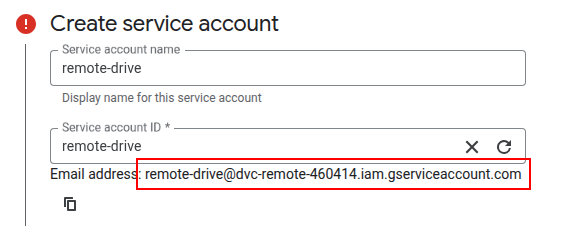
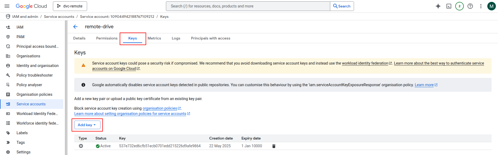
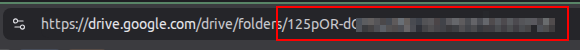

# Model Training


<details>
  <summary><b>Table of Contents</b></summary>
  <ol>
    <li><a href="#about">About</a></li>
    <li>
      <a href="#getting-started">Getting Started</a>
      <ul>
         <li><a href="#Requirements">Requirements</a></li>
         <li><a href="#Install-and-run">Install and Run</a></li>
         <li><a href="#google-drive-remote-storage-instructions"> Google Drive Remote Storage instructions</a></li>
      </ul>
    </li>
    <li>
      <a href="#usage">Usage</a>
      <ul>
         <li><a href="#training-the-model">Training the model</a></li>
         <li><a href="#showing-experimental-results">Showing Experimental Results</a></li>
         <li><a href="#training-configuration-and-parameters">Training Configuration and Parameters</a></li>
      </ul>
    </li>
    <li><a href="#linting">Linting</a></li>
    <li><a href="#tests">Tests</a></li>
    <li><a href="#use-of-generative-ai">Use of Generative AI</a></li>
  </ol>
</details>

# About
This repository contains the DVC-powered machine learning pipeline for training the sentiment analysis model used in our application.

The stucture of this repository was inspired by the [Cookiecutter template](https://github.com/drivendataorg/cookiecutter-data-science/tree/master).

All training code can be found under `src`. Note that the actual preprocessing logic of the training pipeline has ben factored out into the [lib-ml repository](https://github.com/remla25-team12/lib-ml). As such, `src/preprocess_data.py` uses methods from this library.

<!-- TABLE OF CONTENTS -->


# Getting Started

## Requirements

- Linux or macOS (recommended operating system)
- Python 3.9 or higher with pip

## Install and Run

1. Clone this repository and navigate into the root folder:

   ```bash
   git clone https://github.com/remla25-team12/model-training.git
   cd model-training
   ```

2. Install the required Python packages:

   ```bash
   pip install -r requirements.txt
   ```

   > We HIGHLY recommend using a virtual environment, such as `venv` or `conda`, to avoid conflicts with your own Python environments.

3. Initialize DVC:
   ```bash
   dvc init
   dvc config core.analytics false # disable anonymous aggregate usage analytics
   ```

4. Set up your remote storage. 
   - For Google Drive instructions, see [this section of the README](#google-drive-remote-storage-instructions).
   - For local remote storage (recommended), simply add a local storage and set it as the default:
      ```bash
      dvc remote add -d mylocalremote ~/remotedvc
      dvc remote default mylocalremote
      ```

### Google Drive Remote Storage instructions
These instructions are for using Google Drive as the remote storage location in DVC. For ease of use, we will instruct you to set up a Service Account instead of OAuth.
1. In Google Cloud Console, create a [Service Account](https://cloud.google.com/iam/docs/service-accounts-create#creating).
   1. In Step 1, after choosing a name and ID, **take note of the email address shown**, then press `Create and continue`\
      
   2. In Step 2, select the `owner` role, then click `Continue`
   3. In Step 3, add your own Google Account email address to _both_ role fields, then click `Done`
2. Click on the email address and go to the `Keys` tab. Click `Add Key > Create New Key > JSON >  Create`.
   
3. A `.json` file will be downloaded automatically. Rename it to `gdrive_sa_credentials.json` and store it in this repo's root folder.
4. In Google Drive, create a folder you want to use as your remote storage.
   Share this folder with the email address associated with the Service Account created earlier.
5. Navitage into the folder and **take note of the folder ID**.
   
6. Run the following commands to initialize the remote Google Drive storage in DVC:
   ```bash
   dvc remote add myremote gdrive://<FOLDER_ID> -f # Folder ID from previous step
   dvc remote default myremote
   dvc remote modify myremote gdrive_acknowledge_abuse true
   dvc remote modify myremote gdrive_use_service_account true
   dvc remote modify myremote --local gdrive_service_account_json_file_path gdrive_sa_credentials.json # The Service Account key downloaded earlier
      ```

# Usage
## Training the Model

Run the training pipeline with DVC:

```bash
dvc repro
```
The training pipeline generates two model files:

- `Classifier_Sentiment_Model.joblib`: Trained sentiment classification model.
- `c1_BoW_Sentiment_Model.pkl`: Fitted Bag-of-Words vectorizer.

Push the trained model to the remote storage:

```bash
dvc push
```

> Note: If you're working on this repo, make sure to also run commands suggested by DVC in the terminal output, such as `git add dvc.lock`.

To download the most recent models from the remote, run:

```bash
dvc pull
```

> **Note**: Due to Google's security policies, the `dvc pull` and `dvc push` commands may produce errors when using Google Drive as a cloud remote storage. This is an acknowledged problem. Please switch to local remote storage if issues persist.


## Showing Experimental Results

To evaluate and track your machine learning experiments using DVC, you can run the experiments and view their resulting metrics as follows:

1. Run an experiment:

   ```bash
   dvc exp run
   ```

2. View experiment metrics and comparisons:

   ```bash
   dvc exp show
   ```

   > This command displays a table of all tracked experiments along with their metrics, parameters, and timestamps.

## Training Configuration and Parameters
In `params.yaml`, you can set training and model parameters, such as whether to train an alternative classifier (default is Naive Bayes).

# Linting

1. Run Black (code formatter):

   ```bash
   black .
   ```

2. Run isort (import sorter):

   ```bash
   isort .
   ```

3. Run Flake8 (style guide enforcement):

   ```bash
   flake8 --config=linters/setup.cfg .
   ```

4. Run PyLint with custom rules (including nan-check):

   ```bash
   pylint --rcfile=.pylintrc --clear-cache-post-run=y src tests linters
   ```

We customized the default PyLint configuration to better align with the specific needs of our project, particularly in the context of machine learning workflows. One of the key changes involved relaxing the naming convention rules to accommodate commonly used variable names in ML pipelines, such as `X`, `X_train`, `X_test`, `y`, and `y_pred`.

# Tests

Run the tests using pytest:

```bash
pytest tests/
```

Run the complete test suite with coverage and ML test adequacy metrics:

```bash
python3 tests/run_tests.py
```

This command will:

- Run all tests.
- Generate coverage reports.
- Calculate ML test adequacy scores.


# Use of Generative AI:

GitHub Copilot was used to understand and write the pytest cases for model-training.
